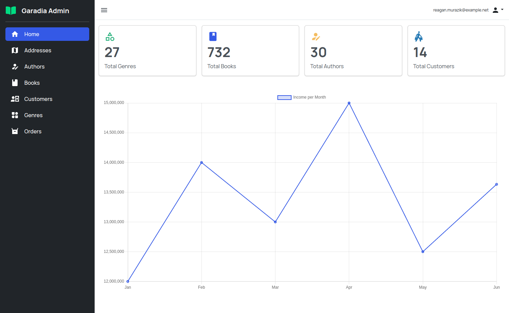
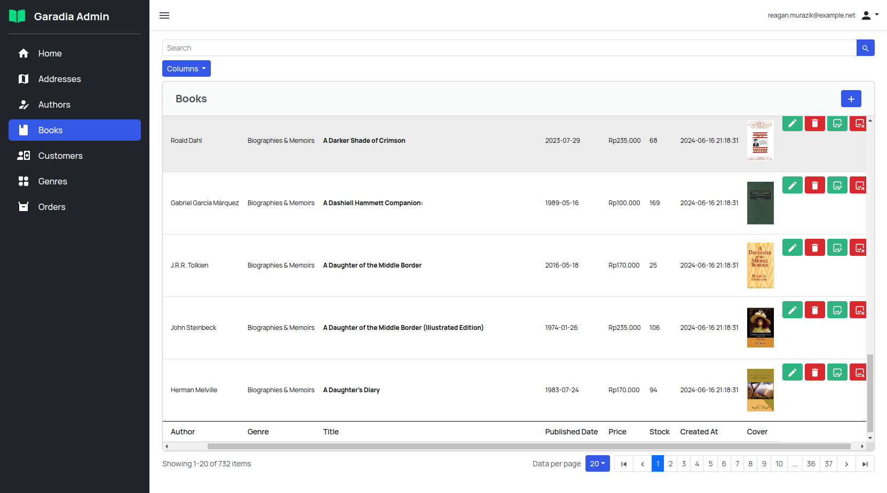
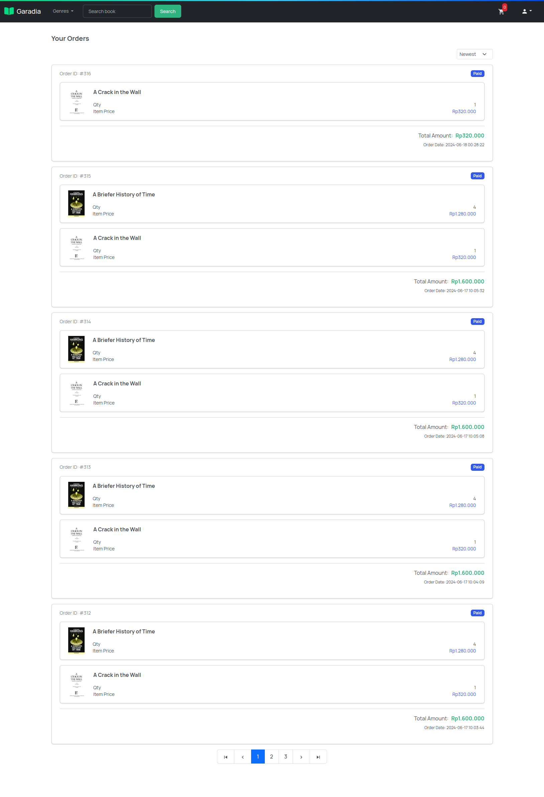

# Online Book Store Front End

## Demo step

1. Setup the backend server first at [this link]("https://www.github.com/online-book-store-backend").
2. Create an .env file at the root project, and add the necessary values.
3. run `npm install`.
4. run `npm run dev`.

## Screenshots

